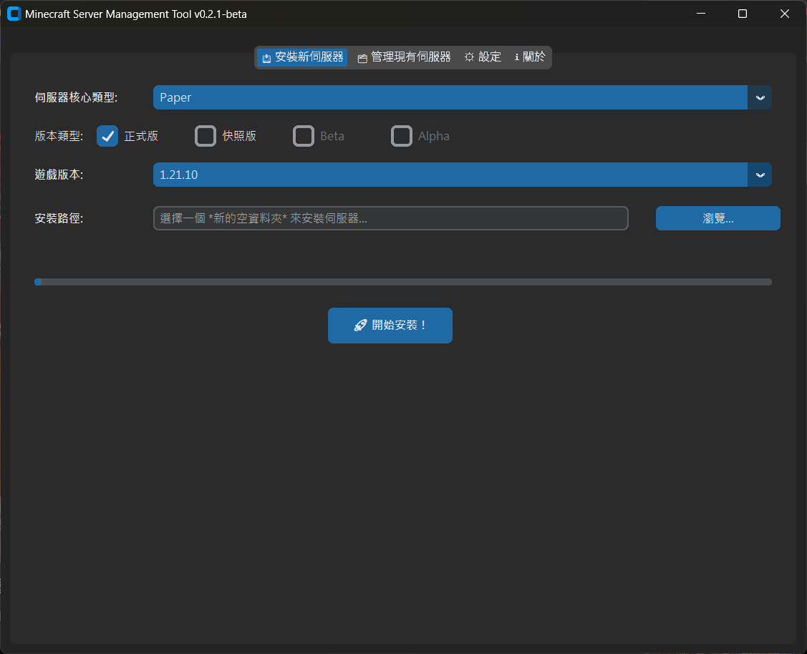

# Minecraft 伺服器管理工具

一個專業、功能全面的 Minecraft 伺服器圖形化管理工具。

 
## 📖 簡介

本工具旨在簡化建立與管理 Minecraft 伺服器的繁瑣流程。它提供了一個直觀的圖形介面，讓您可以輕鬆處理伺服器安裝、設定與日常管理，並支援多種主流的伺服器核心。

## ✨ 主要功能

- **支援多種核心**: 輕鬆安裝各種伺服器核心：
  - Paper
  - Purpur
  - Vanilla (官方版)
  - Forge (提供手動下載輔助)
  - NeoForge
  - Fabric
- **Java 環境管理**: 根據您選擇的 Minecraft 版本，自動下載並管理所需的 Java 運行環境。
- **伺服器管理**:
  - 掃描由本工具建立的現有伺服器。
  - 直接從圖形介面啟動伺服器。
  - 為您的伺服器世界和設定檔建立備份。
- **圖形化設定**:
  - 透過簡單的介面編輯 `server.properties` 檔案。
  - 設定應用程式的全域選項，例如為新伺服器分配的記憶體大小。

## 🚀 如何開始

### 選項一：從原始碼執行
1.  **環境需求**: 請確保您已安裝 Python 3.10 或更新版本。
2.  **安裝依賴**:
    ```bash
    pip install -r requirements.txt
    ```
3.  **執行程式**:
    ```bash
    python main.py
    ```

### 選項二：使用預建置執行檔 (推薦)
1.  **下載**: 從 [Releases](https://github.com/tntapple219/MinecraftServerManager/releases) 頁面取得最新版本。
2.  **解壓縮**: 將下載的檔案解壓縮到您希望的位置。
3.  **執行**: 雙擊 `MinecraftServerManager.exe` 即可啟動應用程式。

## 📦 從原始碼建置

若要建置您自己的執行檔：
1.  **安裝依賴**:
    ```bash
    pip install -r requirements.txt
    ```
2.  **建置執行檔**:
    ```bash
    python build_exe.py
    ```
3.  **尋找結果**: 執行檔和文件將位於 `Release` 資料夾中。

## 👨‍💻 開發者

- **TNTAPPLE**
- **GitHub**: [https://github.com/tntapple219](https://github.com/tntapple219)
- **YouTube**: [https://www.youtube.com/@%E7%82%B8%E5%BD%88%E8%98%8B%E6%9E%9C](https://www.youtube.com/@%E7%82%B8%E5%BD%88%E8%98%8B%E6%9E%9C)